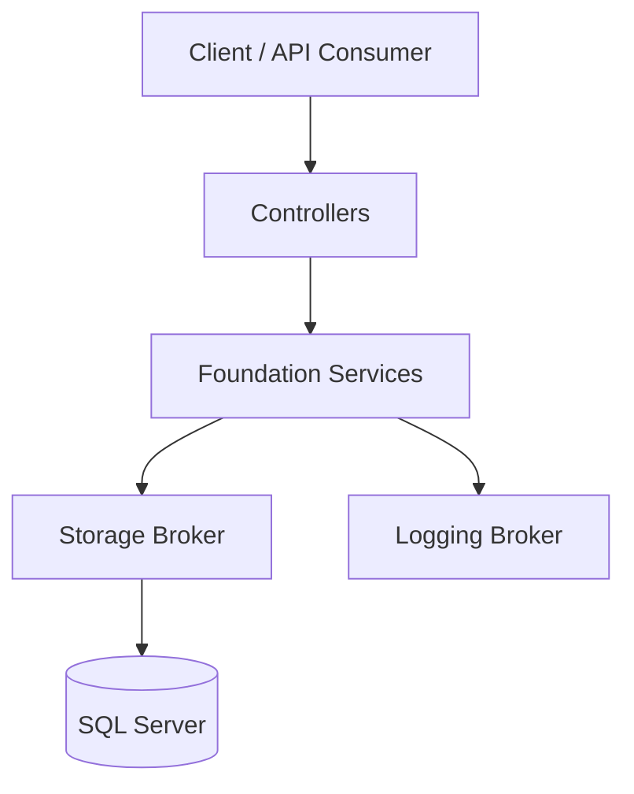

# Architecture

## Overview
Shenam API uses a layered architecture designed for maintainability, testability, and clear separation of concerns.

## Layer Responsibilities

| Layer | Responsibility | Notes |
|---|---|---|
| Controllers | HTTP request/response handling, status code mapping | Keep thin; delegate business logic |
| Services (Foundations) | Business rules, validation, orchestration, exception translation | Main domain behavior lives here |
| Brokers | Infrastructure abstraction (storage + logging) | Decouples services from frameworks |
| Database | Persistent storage (SQL Server via EF Core) | Accessed through Storage Broker |

## Architectural Principles
- **Single responsibility per layer**
- **Dependency inversion** through interfaces
- **Testability-first services** with mocked brokers
- **Explicit exception modeling** for domain clarity

## Request Lifecycle
1. Client sends request to controller.
2. Controller calls corresponding service.
3. Service validates and applies business rules.
4. Service delegates persistence to storage broker.
5. Storage broker performs EF Core operation.
6. Result propagates back to client with mapped HTTP status.

## Mermaid: System Architecture

## Notes for Contributors
- Add new business logic in `Services/Foundations/*`.
- Keep controllers focused on transport concerns.
- Add tests for validation, logic, and exception behavior.
