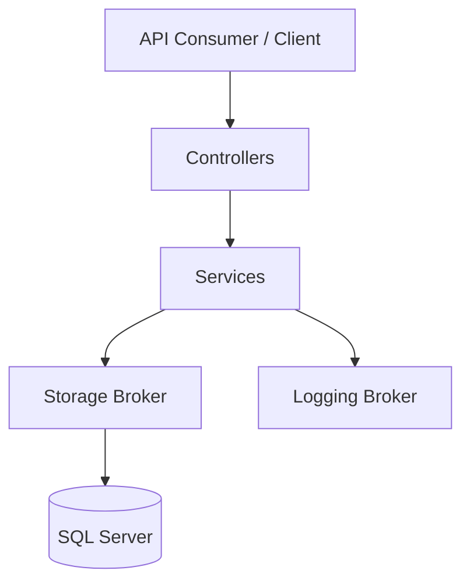
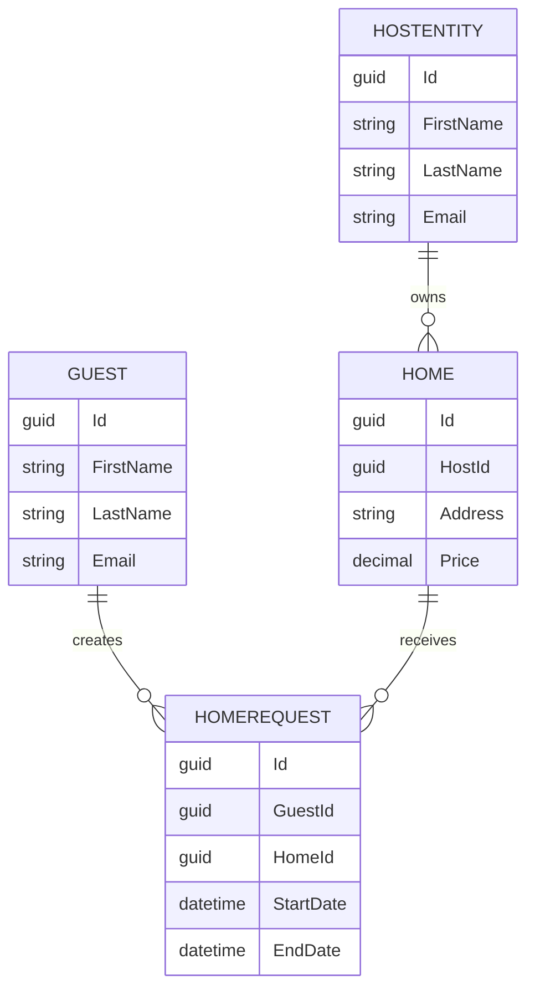
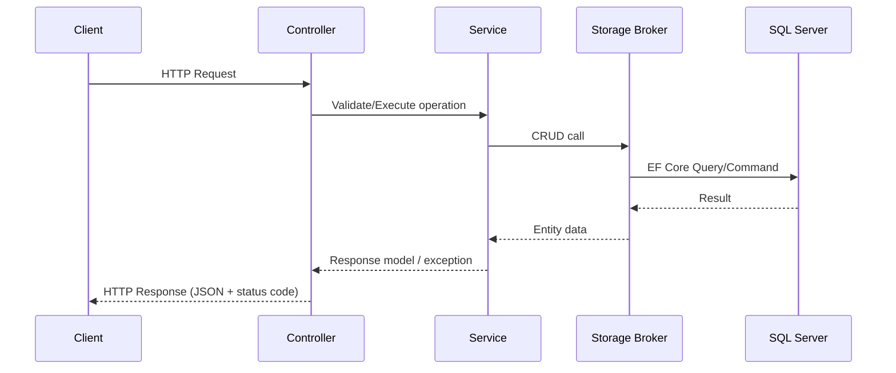

# Diagrams

## 1) System Architecture Diagram

```mermaid
graph TD
    A[API Consumer / Client] --> B[Controllers]
    B --> C[Services]
    C --> D[Storage Broker]
    C --> E[Logging Broker]
    D --> F[(SQL Server)]
```

## 2) Entity Relationship Diagram (ERD)

```mermaid
erDiagram
    GUEST ||--o{ HOMEREQUEST : creates
    HOME ||--o{ HOMEREQUEST : receives
    HOSTENTITY ||--o{ HOME : owns

    GUEST {
        guid Id
        string FirstName
        string LastName
        string Email
    }

    HOSTENTITY {
        guid Id
        string FirstName
        string LastName
        string Email
    }

    HOME {
        guid Id
        guid HostId
        string Address
        decimal Price
    }

    HOMEREQUEST {
        guid Id
        guid GuestId
        guid HomeId
        datetime StartDate
        datetime EndDate
    }
```

## 3) API Request Flow Diagram

```mermaid
sequenceDiagram
    participant C as Client
    participant CT as Controller
    participant S as Service
    participant B as Storage Broker
    participant DB as SQL Server

    C->>CT: HTTP Request
    CT->>S: Validate/Execute operation
    S->>B: CRUD call
    B->>DB: EF Core Query/Command
    DB-->>B: Result
    B-->>S: Entity data
    S-->>CT: Response model / exception
    CT-->>C: HTTP Response (JSON + status code)
```
